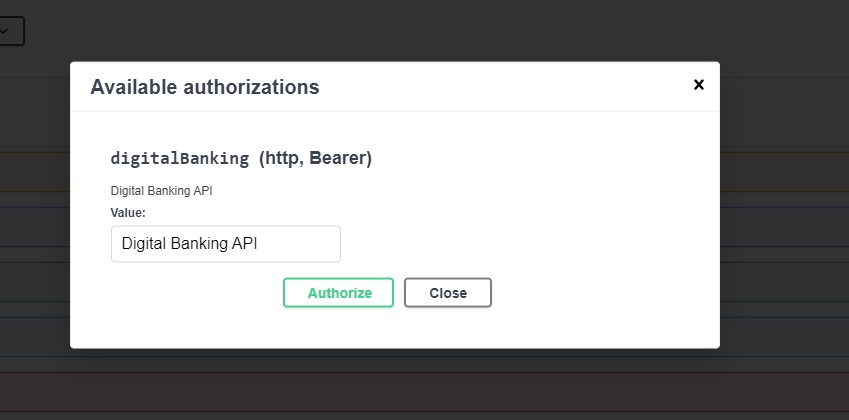

## Projt Spring Angular JWT - Digital Banking
Réalisé par ``Oussama KHOUYA``

On souhaite créer une application qui permet de gérer des comptes bancaires. chaque compte appartient à un client. un compte peut subir plusieurs opérations de type DEBIT ou CREDIT. Il existe deux types de comptes : Comptes courants et comptes épargnes.


>**Le travail à effectuer consiste à développer une application Web basée sur Spring et Angular pour la gestion de comptes bancaires.**

**Les technologies suivantes seront utilisées dans ce dépôt :**
- [x] Backend : Spring
- [x] Frontend : Angular 19
- [x] SGBD : MySQL

## Partie 1 : Backend

## Diagramme de cas d'utilisation du projet Digital banking


**1. Création et test de la couche DAO :**
<ul>
  <li>Définir les entités JPA </li>
 <li>Créer les interfaces JPA Repository basées sur Spring Data </li>
 <li>Tester la couche DAO</li>
</ul>

**2. Création et test de la couche service en utilisant les DTO :**
<ul>
   <li>Créer des objets DTO (Data Transfer Objects) pour transférer les données entre les couches</li>
  <li>Définir les opérations du service pour ajouter des comptes, ajouter des clients, effectuer des débits, des crédits et des virements, et consulter un compte
.</li>
 <li>Implémenter la logique métier pour ces opérations </li>
  <li>Tester les opérations CRUD (Create, Read, Update, Delete) pour les entités </li>
</ul>

**3. Création et test de la couche Web (Rest Controller) en utilisant les DTO  :**
<ul>
  <li>Créer les contrôleurs REST pour exposer les fonctionnalités de l'application</li>
 <li>Définir les endpoints REST pour les opérations du service</li>
 <li>Tester les endpoints à l'aide d'outils comme Swagger</li>
</ul>

**4. Création d'un service d'authentification séparé basé sur Spring Security et JWT :**
<ul>
  <li>Configurer Spring Security pour gérer l'authentification des utilisateurs</li>
 <li>Utiliser JWT (JSON Web Tokens) pour générer et valider les tokens d'authentification</li>
 <li>Implémenter les endpoints nécessaires pour l'inscription et la connexion des utilisateurs</li>
</ul>

**5. Sécurisation de l'application Digital Banking en utilisant Spring Security et JWT :**
<ul>
  <li>Appliquer les configurations de sécurité de Spring Security pour restreindre l'accès aux ressources de l'application</li>
 <li>Configurer les autorisations en fonction des rôles des utilisateurs</li>
 <li>Tester l'authentification et l'autorisation pour s'assurer du bon fonctionnement de la sécurité</li>
</ul>


## Architecture du projet
<div>
   
 &nbsp; &nbsp; &nbsp; &nbsp; &nbsp; &nbsp;  &nbsp; &nbsp; &nbsp; &nbsp; &nbsp; &nbsp; &nbsp; &nbsp; &nbsp; &nbsp; &nbsp;
  

</div>

### Stratégie à adopter

>**Dans notre approche de gestion de l'héritage, une stratégie que nous avons utilisée est celle de la _"Single table"_. Avec cette approche, nous avons créé une seule table qui contient tous les attributs des trois classes concernées. Pour différencier les deux sous-types, nous avons ajouté une colonne spéciale appelée "colonne discriminante". Cette colonne nous permet de distinguer les instances appartenant aux différentes sous-classes au sein de la table unique.**

### Couche DAO
> **Les entités JPA : Customer, BankAccount, Saving Account, CurrentAccount, AccountOperation**
_**Customer**_
```java
@Entity
@Data @NoArgsConstructor @AllArgsConstructor
public class Customer {

  @Id
  @GeneratedValue(strategy = GenerationType.IDENTITY)
    private Long id;
    private String name;
    private String email;
    @OneToMany(mappedBy = "customer")
    private List<BankAccount> bankAccounts;
}
```
_**BankAccount**_
```java
@Entity
@Inheritance(strategy = InheritanceType.SINGLE_TABLE)
@DiscriminatorColumn(name = "TYPE", length = 30, discriminatorType = DiscriminatorType.STRING) // length 255 par défaut et String
@Data @NoArgsConstructor @AllArgsConstructor
public abstract class BankAccount {
 @Id
    private String id;
    private double balance;
    private Date createdDate;
    @Enumerated(EnumType.STRING)
    private AccountStatus status;
    @ManyToOne
    private Customer customer;
    @OneToMany (mappedBy = "bankAccount")
    private List<AccountOperation> accountOperations;

}
```
_**Saving Account**_
```java
@Entity
@DiscriminatorValue("Saving_Account")
@Data @NoArgsConstructor @AllArgsConstructor
public class SavingAccount extends BankAccount{
    private double interestRate;
}
```
_**CurrentAccount**_
```java
@Entity
@DiscriminatorValue("Current_Account")
@Data @NoArgsConstructor @AllArgsConstructor
public class CurrentAccount extends BankAccount{
    private double overDraft;

}
```
_**AccountOperation**_
```java
@Entity
@Data @NoArgsConstructor @AllArgsConstructor
public class AccountOperation {
@Id
@GeneratedValue(strategy = GenerationType.IDENTITY)
    private Long id;
    private Date operationDate;
    private double amount;
    @Enumerated(EnumType.STRING)
    private OperationType operationType;
    @ManyToOne
    private BankAccount bankAccount;
    private String description;
}
```
> **les interfaces JPA Repository pour accéder aux données basées sur Spring Data**
_**CustomerRepository**_
```java
public interface CustomerRepository extends JpaRepository<Customer, Long> {

    @Query("select c from Customer  c where c.name like :kw")
    List<Customer> searchCustomer(@Param("kw") String keyword);
}
```
_**BankAccountRepository**_
```java
public interface BankAccountRepository extends JpaRepository<BankAccount, String> {
    List<BankAccount> getBankAccountByCustomer_Id(Long customerId);
}
```
_**AccountOperationRepository**_
```java
public interface AccountOperationRepository extends JpaRepository<AccountOperation, Long> {

    List<AccountOperation> findByBankAccountId(String accountId);

    Page<AccountOperation> findByBankAccountIdOrderByOperationDateDesc(String accountId, Pageable pageable);
}
```

> **Teste de la couche DAO**
```java
@Bean
    CommandLineRunner start(CustomerRepository customerRepository,
                            BankAccountRepository bankAccountRepository,
                            AccountOperationRepository accountOperationRepository) {
        return args -> {
            Stream.of("Ouassima", "Oualid", "Mohamed").forEach(name -> {
                Customer customer = new Customer();
                customer.setName(name);
                customer.setEmail(name +"@gmail.com");
                customerRepository.save(customer);
            });
            customerRepository.findAll().forEach(customer -> {
                CurrentAccount currentAccount = new CurrentAccount();
                currentAccount.setId(UUID.randomUUID().toString());
                currentAccount.setBalance(Math.random() * 9000);
                currentAccount.setCreatedDate(new Date());
                currentAccount.setStatus(AccountStatus.CREATED);
                currentAccount.setCustomer(customer);
                currentAccount.setOverDraft(9000);
                bankAccountRepository.save(currentAccount);

                SavingAccount savingAccount = new SavingAccount();
                savingAccount.setId(UUID.randomUUID().toString());
                savingAccount.setBalance(Math.random() * 10000);
                savingAccount.setCreatedDate(new Date());
                savingAccount.setStatus(AccountStatus.CREATED);
                savingAccount.setCustomer(customer);
                savingAccount.setInterestRate(4.3);
                bankAccountRepository.save(savingAccount);

            });

            bankAccountRepository.findAll().forEach(account -> {
                for (int i = 0; i < 10; i++) {
                    AccountOperation accountOperation = new AccountOperation();
                    accountOperation.setOperationDate(new Date());
                    accountOperation.setAmount(Math.random() * 13000);
                    accountOperation.setOperationType(Math.random() > 0.5 ? OperationType.DEBIT : OperationType.CREDIT);
                    accountOperation.setBankAccount(account);
                    accountOperationRepository.save(accountOperation);
                }
            });
        };

    }
```
>**Base de données**
```xml
spring.datasource.url=jdbc:mysql://localhost:3306/bank?createDatabaseIfNotExist=true
spring.datasource.username=root
spring.datasource.password=
spring.jpa.hibernate.ddl-auto=create
spring.jpa.properties.hibernate.dialect=org.hibernate.dialect.MariaDBDialect
spring.jpa.show-sql=false
server.port=8080
spring.main.allow-circular-references=true
```
<div align="center">


</div>

### Couche Service
<div align="center">

</div>

> **Création des objets DTO**

<div align="center">

</div>

_**Customer DTO**_,  _**Bank Account DTO**_, _**Cusrrent Account DTO**_, _**Saving Account DTO**_, _**Account OPerations DTO**_, _**Account History DTO**_
  <div align="center">
  
   </div>

_**Operations DTOS**_
<div align="center">
 
 </div>


> **Création des mappers**

```java
@Service
@Transactional
public class BankAccountMapperImpl {

    public CustomerDTO fromCustomer(Customer customer) {
        CustomerDTO customerDTO = new CustomerDTO();
        BeanUtils.copyProperties(customer, customerDTO);
        return customerDTO;
    }
    public Customer fromCustomerDTO(CustomerDTO customerDTO) {
        Customer customer = new Customer();
        BeanUtils.copyProperties(customerDTO, customer);

        return customer;
    }

    public CurrentBankAccountDTO fromCurrentBankAccount (CurrentAccount currentAccount) {
        CurrentBankAccountDTO currentBankAccountDTO = new CurrentBankAccountDTO();
        BeanUtils.copyProperties(currentAccount, currentBankAccountDTO);

        currentBankAccountDTO.setCustomerDTO(fromCustomer(currentAccount.getCustomer()));
        currentBankAccountDTO.setType(currentAccount.getClass().getSimpleName());

        return currentBankAccountDTO;
    }
    public CurrentAccount fromCurrentAccountDTO (CurrentBankAccountDTO currentBankAccountDTO) {
        CurrentAccount currentAccount = new CurrentAccount();
        BeanUtils.copyProperties(currentBankAccountDTO, currentAccount);

        currentAccount.setCustomer(fromCustomerDTO(currentBankAccountDTO.getCustomerDTO()));
        return currentAccount;
    }

    public SavingBankAccountDTO fromSavingBankAccount (SavingAccount savingAccount) {
        SavingBankAccountDTO savingBankAccountDTO = new SavingBankAccountDTO();
        BeanUtils.copyProperties(savingAccount, savingBankAccountDTO);

        savingBankAccountDTO.setCustomerDTO(fromCustomer(savingAccount.getCustomer()));
        savingBankAccountDTO.setType(savingAccount.getClass().getSimpleName());
        return savingBankAccountDTO;
    }
    public SavingAccount fromSavingBankAccountDTO (SavingBankAccountDTO savingBankAccountDTO) {
        SavingAccount savingAccount = new SavingAccount();

        BeanUtils.copyProperties(savingBankAccountDTO, savingAccount);

        savingAccount.setCustomer(fromCustomerDTO(savingBankAccountDTO.getCustomerDTO()));

        return savingAccount;
    }

    public AccountOperationDTO fromAccountOperation(AccountOperation accountOperation) {
        AccountOperationDTO accountOperationDTO = new AccountOperationDTO();
        BeanUtils.copyProperties(accountOperation, accountOperationDTO);

        return accountOperationDTO;
    }
}
 ```
> **Définition les opérations du service**

_**Interface BankAccountService**_

```java
public interface BankAccountService {

  CustomerDTO saveCustomer(CustomerDTO customerDTO);

  CurrentBankAccountDTO saveCurrentBankAccount(double initialBalance, double overDraft, Long customerId) throws CustomerNotFoundException;
  SavingBankAccountDTO saveSavingBankAccount(double initialBalance, double interestRate, Long customerId) throws CustomerNotFoundException;

  BankAccountDTO updateBankAccount(String accountId, AccountStatus accountStatus) throws BankAccountNotFoundException;

  List<CustomerDTO> listCustomer();

  BankAccountDTO getBankAccount(String id) throws BankAccountNotFoundException;

  void debit(String accountId, double amount, String description) throws BankAccountNotFoundException, BalanceNotSufficientException;
  void credit(String accountId, double amount, String description) throws BankAccountNotFoundException;

  void transfer(String accountIdSource, String accountIdDestination, double amount) throws BankAccountNotFoundException, BalanceNotSufficientException;

  List<BankAccountDTO> getListBankAccounts();

  CustomerDTO getCustomer(Long customerId) throws CustomerNotFoundException;

  CustomerDTO updateCustomer(CustomerDTO customerDTO);

  void deleteCustomer(Long customerId) throws CustomerNotFoundException;

  List<AccountOperationDTO> getAccountHistoryByList(String accountId);

  List<BankAccountDTO> getBankAccountsByCustomerId(Long customerId);

  AccountHistoryDTO getAccountHistoryByPage(String accountId, int page, int size) throws BankAccountNotFoundException;

  List<CustomerDTO> searchCustomers(String keyword);
}
```
🔗[➤ **Implémentation de la logique métier pour ces opérations** ](https://github.com/Akasmiou-ouassima/Digital-Banking-Backend/blob/main/Digital-banking-backend-Spring/src/main/java/com/akasmiou/ouassima/EBanking/services/BankAccountServiceImpl.java)

>_**Tester les opérations CRUD**_

```java
@Bean
    CommandLineRunner start (AccountService accountService) {
        return args -> {
            Stream.of("Ouassima", "Mohamed", "Jinan", "Oualid").forEach(name -> {
                CustomerDTO customerDTO = new CustomerDTO();
                customerDTO.setName(name);
                customerDTO.setEmail(name + "@gmail.com");
                bankAccountService.saveCustomer(customerDTO);
            });
            bankAccountService.listCustomer().forEach( customer -> {
                try {
                    bankAccountService.saveCurrentBankAccount(Math.random() * 90000, 9000, customer.getId());
                    bankAccountService.saveSavingBankAccount(Math.random() * 85000, 3.2, customer.getId());
                } catch (CustomerNotFoundException e) {
                    e.printStackTrace();
                }
            });

            try {
                List<BankAccountDTO> bankAccountList = bankAccountService.getListBankAccounts();
                for (BankAccountDTO bankAccount : bankAccountList) {
                    for (int i = 0; i < 10; i++) {
                        String accountId;
                        if(bankAccount instanceof SavingBankAccountDTO) {
                            accountId = ((SavingBankAccountDTO) bankAccount).getId();
                        } else {
                            accountId = ((CurrentBankAccountDTO) bankAccount).getId();
                        }
                        bankAccountService.credit(
                                accountId,
                                10000 + Math.random() * 120000,
                                "Credit");

                        bankAccountService.debit(
                                accountId,
                                1000 + Math.random() * 9000,
                                "Debit");

                    }
                }
            } catch (BalanceNotSufficientException | BankAccountNotFoundException e) {
                e.printStackTrace();
            }
        };
    }
   ```

> **Teste les endpoints à l'aide d'outils comme Swagger**

```java
L'interface de test de notre API, générée par Swagger, est accessible via http://localhost:8080/swagger-ui/index.html
```


**_Teste de la méthode GET Customers_**


**_Teste de la méthode GET Customer By Id_**


**_Teste de la méthode GET Accounts_**


### Couche Security

>La classe SecurityConfig configure la sécurité dans une application Java avec Spring Security. Les principales étapes incluent la désactivation de CSRF, la configuration de la politique >de sessions, la gestion de CORS, l'autorisation d'accès à certaines URL et l'ajout de filtres JWT personnalisés pour l'authentification et l'autorisation.

> **_Security dans OpenAPI_**

> Si vous accédez à Swagger UI et que vous voyez le bouton "Authorize", cela signifie que l'API que vous consultez nécessite une authentification. Pour vous authentifier et autoriser votre application
> Donc L'annotation @SecurityScheme est utilisée pour définir un schéma d'authentification dans le contexte de l'API Digital Bank.

```java
@SecurityScheme(name = "digitalBankApi", description = "Digital Bank API", type = SecuritySchemeType.HTTP, scheme = "bearer", bearerFormat = "JWT")
```
<div align="center">

 </div>
<div align="center">

 </div>
<div align="center">

 </div>


## Partie 2 : Client Angular

### Configuration des Routes

L'application Angular utilise un système de routage pour naviguer entre les différentes vues. Les routes sont définies dans le fichier `app.routes.ts` :

```typescript
export const routes: Routes = [
  { path: "", pathMatch: "full", redirectTo: "login" },
  { path: "login", component: LoginComponent },
  {
    path: "admin", 
    component: AdminTemplateComponent, 
    canActivate: [authenticationGuard],
    children: [
      { path: "", pathMatch: "full", redirectTo: "customers" },
      { path: "customers", component: CustomersComponent },
      { path: "accounts", component: AccountsComponent },
      { path: "new-customer", component: NewCustomerComponent, 
        canActivate: [authorizationGuard], 
        data: { roles: ["ADMIN"] }
      },
      { path: "customer-accounts/:id", component: CustomerAccountsComponent },
      { path: "notAuthorized", component: NoAuthorizedComponent }
    ]
  }
];
```

Les routes sont protégées par deux guards :
- `authenticationGuard` : Vérifie si l'utilisateur est authentifié
- `authorizationGuard` : Vérifie les rôles de l'utilisateur pour certaines routes

### Composant Customer-Accounts

Le composant `CustomerAccountsComponent` permet d'afficher les comptes d'un client spécifique :

```typescript
@Component({
  selector: 'app-customer-accounts',
  imports: [NgIf, NgForOf, DecimalPipe, DatePipe],
  templateUrl: './customer-accounts.component.html',
  standalone: true
})
export class CustomerAccountsComponent implements OnInit {
  customerId!: string;
  customer!: Customer;
  accounts: Account[] = [];
  errorMessage!: string;

  constructor(
    private route: ActivatedRoute,
    private router: Router,
    private accountService: AccountService
  ) {
    this.customer = this.router.getCurrentNavigation()?.extras.state as Customer;
  }

  ngOnInit(): void {
    this.customerId = this.route.snapshot.params['id'];
    this.loadCustomerAccounts();
  }

  loadCustomerAccounts() {
    this.accountService.getCustomerAccounts(this.customerId).subscribe({
      next: (data) => {
        this.accounts = data;
      },
      error: (err) => {
        this.errorMessage = err.message;
      }
    });
  }

  handleOperations(accountId: string) {
    this.router.navigate(['/admin/accounts'], { 
      queryParams: { id: accountId }
    });
  }
}
```

### Service Account

Le service `AccountService` gère les opérations liées aux comptes bancaires. Il communique avec le backend via des requêtes HTTP :

```typescript
@Injectable({
  providedIn: 'root'
})
export class AccountService {
  constructor(private http: HttpClient) { }

  // Récupérer les comptes d'un client
  public getCustomerAccounts(customerId: string): Observable<Array<Account>> {
    return this.http.get<Array<Account>>(environment.backendHost + "/accounts/customer/" + customerId);
  }

  // Récupérer les opérations d'un compte
  public getAccount(accountId: string, page: number, size: number): Observable<AccountDetails> {
    return this.http.get<AccountDetails>(environment.backendHost + "/accounts/" + accountId + "/pageOperations?page=" + page + "&size=" + size);
  }

  // Effectuer une opération de débit
  public debit(accountId: string, amount: number, description: string) {
    let data = { accountId, amount, description }
    return this.http.post(environment.backendHost + "/accounts/debit", data);
  }

  // Effectuer une opération de crédit
  public credit(accountId: string, amount: number, description: string) {
    let data = { accountId, amount, description }
    return this.http.post(environment.backendHost + "/accounts/credit", data);
  }

  // Effectuer un transfert entre comptes
  public transfer(accountSource: string, accountDestination: string, amount: number, description: string) {
    let data = { accountSource, accountDestination, amount, description }
    return this.http.post(environment.backendHost + "/accounts/transfer", data);
  }
}
```

Cette implémentation permet de :
- Afficher la liste des comptes d'un client
- Consulter les opérations d'un compte
- Effectuer des opérations de débit et crédit
- Réaliser des transferts entre comptes

Toutes ces fonctionnalités sont sécurisées et nécessitent une authentification valide pour être accessibles.

## Partie 3 : Sécuriser l'application avec un système d'authentification basé sur Spring Security et Json Web Token
````java
@Configuration
@EnableWebSecurity
@EnableGlobalMethodSecurity(prePostEnabled = true)
public class SecurityConfig {

    @Bean
    public PasswordEncoder passwordEncoder(){
        return new BCryptPasswordEncoder();
    }

    @Bean
    public InMemoryUserDetailsManager inMemoryUserDetailsManager(){
        return  new InMemoryUserDetailsManager(
                User.withUsername("user1").password(passwordEncoder().encode("azerty123456")).authorities("USER").build(),
                User.withUsername("admin").password(passwordEncoder().encode("azerty123456")).authorities("USER","ADMIN").build()
        );
    }

    @Bean
    public SecurityFilterChain securityFilterChain(HttpSecurity httpSecurity) throws Exception {
        return httpSecurity
                .sessionManagement(sm->sm.sessionCreationPolicy(SessionCreationPolicy.STATELESS))
                .csrf(csrf->csrf.disable())
                .cors(Customizer.withDefaults())
                .authorizeHttpRequests(ar->ar
                        .requestMatchers("/auth/login/**","/refreshToken/**","/swagger-ui**",
                                "/swagger-ui/**","/v3/**", "/v1/**").permitAll()
                        .anyRequest().authenticated())
                .oauth2ResourceServer(oa->oa.jwt(Customizer.withDefaults()))
                .httpBasic(Customizer.withDefaults())
                .build();
    }

    @Value("${jwt.secret}")
    private String secretKey;

    @Bean
    public JwtEncoder jwtEncoder(){
        return new NimbusJwtEncoder(new ImmutableSecret<>(secretKey.getBytes()));
    }

    @Bean
    public JwtDecoder jwtDecoder(){
        SecretKeySpec secretKeySpec = new SecretKeySpec(secretKey.getBytes(), "RSA");
        return NimbusJwtDecoder.withSecretKey(secretKeySpec).macAlgorithm(MacAlgorithm.HS512).build();
    }

    @Bean
    public AuthenticationManager authenticationManager(UserDetailsService userDetailsService){
        DaoAuthenticationProvider daoAuthenticationProvider = new DaoAuthenticationProvider();
        daoAuthenticationProvider.setPasswordEncoder(passwordEncoder());
        daoAuthenticationProvider.setUserDetailsService(userDetailsService);
        return new ProviderManager(daoAuthenticationProvider);
    }

    @Bean
    CorsConfigurationSource corsConfigurationSource(){
        CorsConfiguration corsConfiguration = new CorsConfiguration();
        corsConfiguration.addAllowedOrigin("*");
        corsConfiguration.addAllowedMethod("*");
        corsConfiguration.addAllowedHeader("*");
        UrlBasedCorsConfigurationSource source=new UrlBasedCorsConfigurationSource();
        source.registerCorsConfiguration("/**",corsConfiguration);
        return source;
    }
}
````